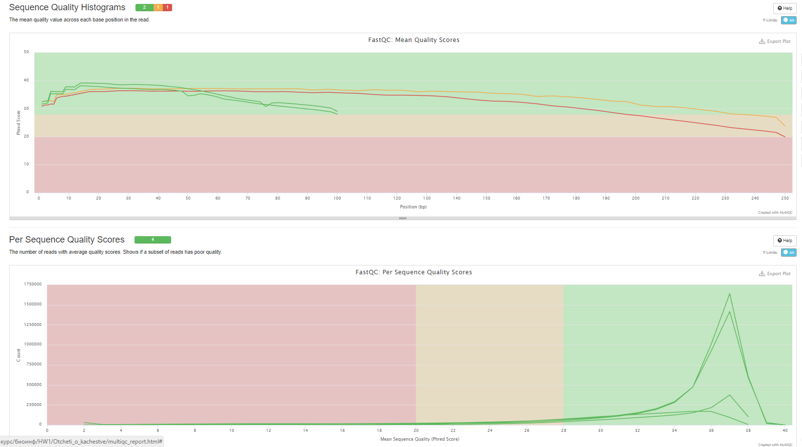
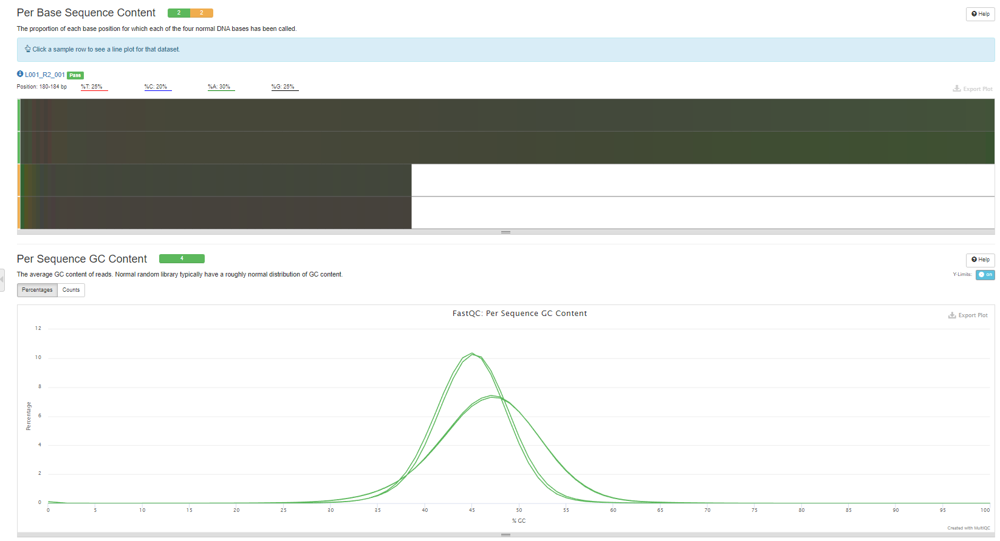
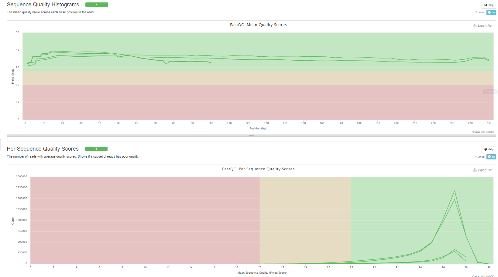

Список команд на сервере:

    1.  ln -s /usr/share/data-minor-bioinf/assembly/* .
    2.  ls
    3.  seqtk sample -s 111 oi1MP_S4_L001_R1_001.fastq 1500000
    4.  seqtk sample -s 111 oilMP_S4_L001_R1_001.fastq 1500000
    5.  seqtk sample -s 111 oilMP_S4_L001_R1_001.fastq 1500000 > L001_R1_001.fastq
    6.  seqtk sample -s 111 oilMP_S4_L001_R2_001.fastq 1500000 > L001_R2_001.fastq
    7.  ls
    8.  seqtk sample -s 111 oil_R1.fastq 5000000 > oil_R1.fastq
    9.  seqtk sample -s 111 oil_R1.fastq 5000000 > L001_oil_R1.fastq
   10.  seqtk sample -s 111 oil_R2.fastq 5000000 > L001_oil_R2.fastq
   11.  mkdir Otcheti_o_kachestve
   12.  mv L001* Otcheti_o_kachestve
   13.  cd Otcheti_o_kachestve
   14.  fastqc *
   15.  multiqc .
   16.  ls
   17.  mv L001_oil_R2.fastq L001_R1_001.fastq L001_R2_001.fastq ../
   18.  ls
   19.  mv L001_oil_R1.fastq ../
   20.  ls
   21.  cd..
   22.  cd ..
   23.  mkdir Otcheti_o_podrez
   24.  ls
   25.  sp L001_oil_R1.fastq L001_oil_R2.fastq L001_R1_001.fastq L001_R2_001.fastq Otcheti_o_podrez/
   26.  cp L001_oil_R1.fastq L001_oil_R2.fastq L001_R1_001.fastq L001_R2_001.fastq Otcheti_o_podrez/
   27.  cd Otcheti_o_podrez/
   28.  platanus_trim L001_oil_R1.fastq L001_oil_R2.fastq
   29.  ls
   30.  mkdir Trimmed_oil
   31.  cp L001_oil_R1.fastq.trimmed L001_oil_R2.fastq.trimmed Trimmed_oil/
   32.  platanus_internal_trim L001_R1_001.fastq L001_R2_001.fastq
   33.  ls
   34.  cp L001_R1_001.fastq.int_trimmed L001_R2_001.fastq.int_trimmed Trimmed_oil
   35.  cd Trimmed_oil/
   36.  ls
   37.  fastqc *
   38.  multiqc .
   39.  ls
   40.  rm L001_oil_R1.fastq.trimmed L001_oil_R2.fastq.trimmed L001_R1_001.fastq.int_trimmed L001_R2_001.fastq.int_trimmed
   41.  ls
   42.  cd ..
   43.  ls
   44.  mkdir Trim
   45.  mv L001_oil_R1.fastq.trimmed L001_oil_R2.fastq.trimmed L001_R1_001.fastq.int_trimmed L001_R2_001.fastq.int_trimmed Trim
   46.  ls
   47.  cd Trim
   48.  ls
   49.  platanus assemble -f  L001_oil_R1.fastq.trimmed L001_oil_R2.fastq.trimmed
   50.  ls
   51.  platanus scaffold -c out_contig.fa -IP1 *.trimmed -OP2 *.int_trimmed
   52.  platanus gap_close -c out_scaffold.fa -IP1 *.trimmed -OP2 *.int_trimmed
   53.  ls
   54.  mkdir Final
   55.  mv out_contig.fa out_gapClosed.fa out_scaffold.fa Final
   56.  Exit

multiqc:
1. 
2. 
3. 

multiqc:
1. 
2. 
3. 

Код из коллаба:
1. with open ('out_contig.fa') as f:
  x = f.read()
arr = x.split('>')
len_arr = [len(x) for x in arr]
max_element = arr[len_arr.index(max(len_arr))]
len_arr = sorted(len_arr)
sum = 0
for item in len_arr:
  n50 = item
  sum += item
  if sum > (len(x)/2):
    break
print('Количество контигов', len(arr))
print('Суммарная длинна всех объектов', len(x))
print('Максимальная длинна объекта', max(len_arr))
print('n50 = ', n50)

Вывод:

Количество контигов 617
Суммарная длинна всех объектов 3988844
Максимальная длинна объекта 181572
n50 =  52256

2.with open ('out_gapClosed.fa') as f:
  x = f.read()
arr = x.split('>')
len_arr = [len(x) for x in arr]
max_element = arr[len_arr.index(max(len_arr))]
len_arr = sorted(len_arr)
sum = 0
for item in len_arr:
  n50 = item
  sum += item
  if sum > (len(x)/2):
    break
cnt = 0
for i in range(len(max_element)):
  if (max_element[i-1] == "N") and (max_element[i] != "N"):
    cnt += 1
print('Количество гэпов в самом длинном элементе', cnt)
print('Количество скаффолдов с закрытыми гэпами', len(arr))
print('Суммарная длинна всех объектов', len(x))
print('Максимальная длинна объекта', max(len_arr))
print('n50 = ', n50)

Вывод:

Количество гэпов в самом длинном элементе 36
Количество скаффолдов с закрытыми гэпами 76
Суммарная длинна всех объектов 3973489
Максимальная длинна объекта 3927325
n50 =  3927325

3. with open ('out_scaffold.fa') as f:
  x = f.read()
arr = x.split('>')
len_arr = [len(x) for x in arr]
max_element = arr[len_arr.index(max(len_arr))]
len_arr = sorted(len_arr)
sum = 0
for item in len_arr:
  n50 = item
  sum += item
  if sum > (len(x)/2):
    break
cnt = 0
for i in range(len(max_element)):
  if (max_element[i-1] == "N") and (max_element[i] != "N"):
    cnt += 1
print('Количество гэпов в самом длинном элементе', cnt)
print('Количество скаффолдов',len(arr))
print('Суммарная длинна всех объектов', len(x))
print('Максимальная длинна объекта', max(len_arr))
print('n50 = ', n50)

Вывод:

Количество гэпов в самом длинном элементе 149
Количество скаффолдов 76
Суммарная длинна всех объектов 3927603
Максимальная длинна объекта 3880778
n50 =  3880778
